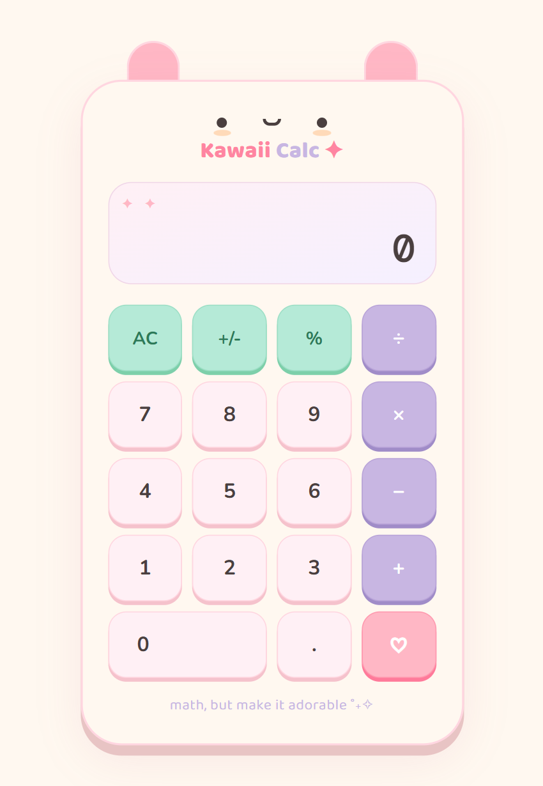

# 🍬 Kawaii Calc

> *Math, but make it adorable.*

A cutesy-themed calculator app built with **React 19** as part of a hands-on learning journey. This project focuses on real-world React patterns, clean file structure, and professional habits — wrapped in a pastel candy aesthetic.

# 🔗 Links

- **Live Demo:** [https://kawaii-math-calculator.netlify.app/](https://kawaii-math-calculator.netlify.app/)
- **Repository:** [https://github.com/MahmudaJahan99/kawaii-calculator](https://github.com/MahmudaJahan99/kawaii-calculator)

---

## ✨ Features

- Full arithmetic: addition, subtraction, multiplication, division
- Percentage and negation (`%`, `+/-`)
- Chained operations (e.g. `5 + 3 × 2`)
- Expression display showing the current operation
- Divide-by-zero and edge-case handling
- Animated button presses with Framer Motion
- Fully responsive, centered layout

---

## ⚛️ React Concepts Practiced

| Concept | Where |
|---|---|
| `useState` | `useCalculator.js` — all calculator state |
| Custom Hooks | `useCalculator.js` — logic fully decoupled from UI |
| Component composition | `Calculator → ButtonGrid → CalcButton` |
| Props & destructuring | All components receive typed props |
| Data-driven rendering | `ButtonGrid` maps `BUTTON_CONFIG` array |
| CSS Modules | Scoped styles per component |
| `StrictMode` | `main.jsx` — catches impure renders in dev |
| Controlled state | Display is 100% driven by hook state |

---

## 🧰 Tech Stack

| Tool | Purpose |
|---|---|
| [React 19](https://react.dev) | UI framework |
| [Vite](https://vitejs.dev) | Build tool & dev server |
| [CSS Modules](https://github.com/css-modules/css-modules) | Scoped component styles |
| [Framer Motion](https://www.framer.com/motion/) | Button animations |
| [clsx](https://github.com/lukeed/clsx) | Conditional className utility |
| [ESLint](https://eslint.org) + [Prettier](https://prettier.io) | Code quality & formatting |

---

## 🎨 Design System

**Fonts** — Google Fonts

| Font | Role |
|---|---|
| Baloo 2 | Logo / display headings |
| Nunito | Button labels |
| DM Mono | Calculator display numbers |

**Color Palette**

| Token | Hex | Role |
|---|---|---|
| `--kc-bg` | `#FFF8F0` | Page background |
| `--kc-pink` | `#FFB7C5` | Equals button |
| `--kc-lavender` | `#C8B6E2` | Operator buttons |
| `--kc-mint` | `#B5EAD7` | Action buttons |
| `--kc-peach` | `#FFDAB9` | Accent / cheeks |
| `--kc-text` | `#4A3F3F` | Primary text |

---

## 👩‍💻 Author

Mahmuda Jahan. Built as Project of a React 19 learning journey.

---

## License

MIT